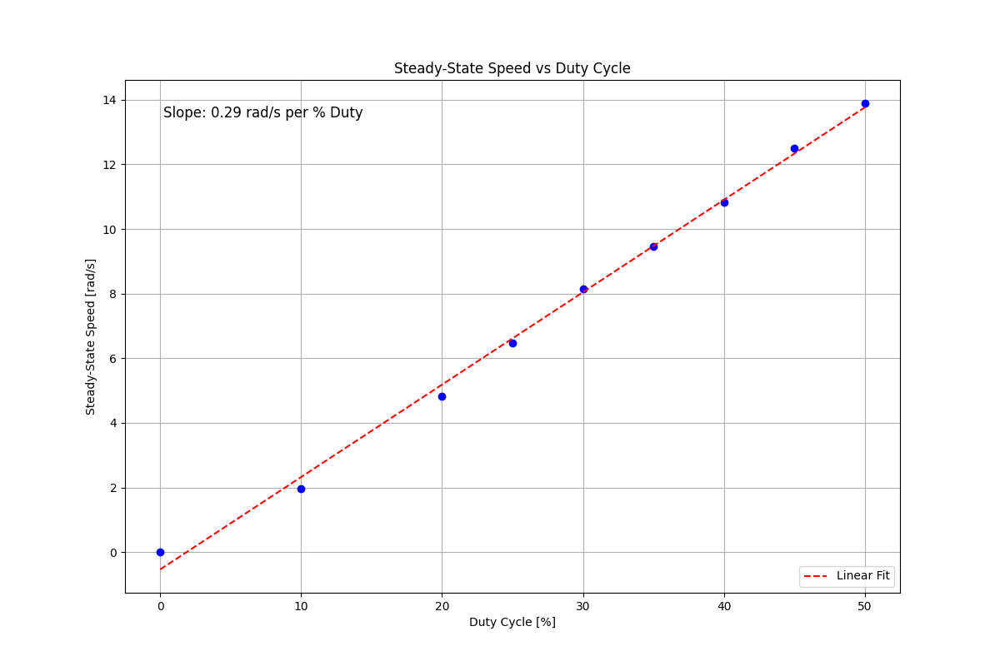
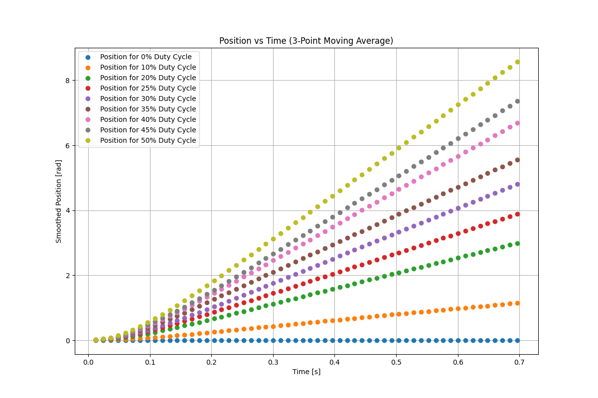
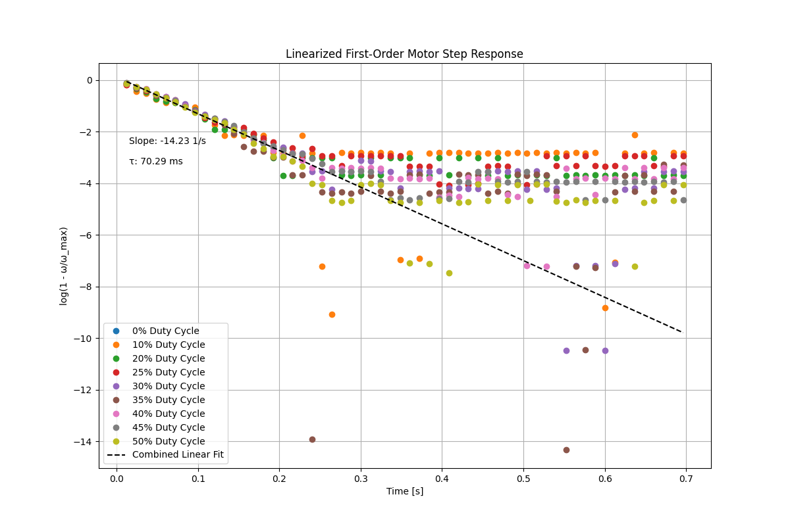

# README
This repository contains the code and report for the ME405 course term project at Cal Poly. \
The documentation follows below under the Report section. 

## [Code](./code/)

###  Driver Files

This section contains the essential **driver files** required for controlling the various hardware components of the robot. These files handle **low-level hardware interactions**, including sensor readings, motor control, and communication.

Files:
- [`bluetooth.py`](./code/bluetooth.py)
- [`bno055.py`](./code/bno055.py)
- [`bump.py`](./code/bump.py)
- [`controller.py`](./code/controller.py)
- [`encoder.py`](./code/encoder.py)
- [`line_sensor.py`](./code/line_sensor.py)
- [`motor.py`](./code/motor.py)
- [`IMU.py`](./code/IMU.py)
- [`tasks.py`](./code/tasks.py)

###  Main file

The [`main.py`](./code/main.py) file serves as the central execution script for the development board that coordinates the driver tasks into a cohesive executable. It initializes tasks, runs the scheduler, and manages high-level decision-making for the Romi robot execution.

### Firmware

The firmware for the micropython interpreter is provided in the file [`firmware.bin`](./code/firmware.bin). 

---

## [Figures](./figures/)

Repository of any figure images, plots or additional calculations that did not fit into the report poriton of this markdown. 

---

# Report

## Introduction
### Abstract
In the following sections, the design, analysis, and results of a programmed Romi bot with a micropython programmed nucleo STM32L476 to complete an obstacle course will be detailed. The base mechatronic system comprises two wheels, two independent motors, two encoders and the general chassis. This overall system is wired through typical pin headers to assign purpose to each of these components and the other later added parts. Together the electrical and mechanical components will intertwine in a micropython code, interpreted through the “Shoe of Brian”. The “Shoe of Brian” is simply an interpreter that allows for the STM32 chip to process micropython commands, as opposed to C programming. Ultimately, all of these components are put together to complete the course with a high degree of repeatability and speed. 

### Problem statement
The primary task is to complete the following track in figure 1 using the Romi bot, with the highest speed and reliability possible. Approach for this task is fully up to the interpretation of the team, with the only requirement being the checkpoints. The bot is able to disregard the lines entirely, but for a systematic approach the lines will be needed in order to hit preceding checkpoints. Based on the structure of the track, it is inevitable that there will be hardcoded portions which will cause the program to be a mix of algorithmic and hard coded.\


---

## Design
### Mechanical design
This project aims to develop a mechatronic navigation system capable of autonomously traversing, with minimal hard coded portions,  a predefined track. The core components are built upon the Pololu Romi Chassis, with an STM32 Nucleo board, encoders, an IMU (BNO055), bump sensors, and an IR reflectance sensor array (7-sensor line sensor). By integrating all these components, the robot can navigate the track with a mixture of dynamic and hard coded control. Following will be a greater in depth background of the aforementioned components: 

#### **Pololu Romi Chassis**
The Pololu Romi Chassis is a lightweight and versatile robotic platform. It provides:
- Integrated motor mounts for two DC motors and encoders.
- Ball caster support for smooth movement and stability.
- Expandable design, allows for additional components to be directly mounted.

This chassis serves as the foundation for the entirety of the mechanical system.


---

#### **Motor Driver and Power Distribution Board**
The Motor Driver and Power Distribution Board provides basic interfacing for motor control and power management of the Romi. It features:
- Dual-channel H-Bridge Motor Driver for speed and direction control.
- 5V and 3.3V regulators to safely power the sensors and additional controllers.
- PWM control support for smooth motor actuation.
- Battery management with direct interfacing to the six batteries and a dedicated power switch.

This board provides efficient motor control and power distribution to all system components.

---

#### **STM32 Nucleo-L476RG**
The STM32 Nucleo-L476RG is a basic development board that serves as the main processing unit for the Romi. Key features:
- Multiple I/O interfaces including I²C, SPI, and UART.
- ST-Link debugger for programming and real-time debugging.
- Relatively high performance at overall low costs.

The Nucleo enables efficient real-time control of the Romi’s sensors, actuators, and wireless communication.

---
#### **“Shoe of Brian”**
The “Shoe of Brian” is a custom micropython interpreter for the STM32 Nucleo-L476RG to interface all of the pin headers with micropython instead of the language C. Key features:
- Plugs directly into the header pins of the STM32 Nucleo-L476RG
- Compatible with any other development board with the same headings
- Bypasses the Nucleo interpreter to allow for programming in external languages, specifically micropython

The “Shoe of Brian” enables the development board to interpret micropython code.

---

#### **Romi Encoder Pair**
The Romi encoders provide quadrature encoder values for tracking motor movement, ensuring accurate speed and position feedback. Features:
- High-resolution position tracking using quadrature encoding, namely 1440 counts per revolution.
- Essential for improving the accuracy of closed-loop control.
- Real-time operation  to assist in speed regulation and trajectory planning.

These encoders help the robot navigate accurately by monitoring its movement of each wheel independently.

---

#### **BNO055 (IMU)**
The BNO055 is a 9-axis IMU that provides orientation, acceleration, and angular velocity data. Key capabilities:
- Integrated sensor fusion algorithms for real-time orientation tracking.
- Gyroscope-based location data to improve heading accuracy and for bot tracking.
- Critical for clean turn control and maintaining straight-line movement by checking orientation.

This IMU allows for precise turns and heading corrections during navigation.

---

#### **Bump Sensors**
The bump sensor detects physical obstacles by closing an electrical circuit when pressed to pull pin low. Functions:
- Trigger an input when a collision is detected.
- Enable reactive obstacle avoidance to trigger navigation sequences.
- Simply effective sensor that only requires a total of two grounds and two GPIO pins to cover the whole front.

Bump sensors provide a straightforward method of collision detection for course correction. 

---

#### **IR Reflectance Sensors (Line Sensor)**
The IR line sensors or line sensors detect contrasts between surfaces using infrared reflectance over seven total sensors. Features:
- Line-following capability by detecting dark/light surface differences and calculating a centroid.
- Allows for real-time corrections to maintain a smooth path.
- Compatible with PID control to optimize trajectory tracking and smoothness.

These sensors allow the robot to correct its  path by following black lines of varying widths based on PID controller feedback.

---

#### **HC-05 Bluetooth Module**
The HC-05 is a standard bluetooth module that enables wireless communication with external devices, such as the programming device. Key functions:
- Serial (UART) communication for wireless data transfer.
- Remote debugging and monitoring via a bluetooth-connected PC.
- Standard baud rate of about 400k cycles per second, providing high performance.

This module enables remote control, allowing for a more seamless programming and usage experience.

---

These components were chosen to match the specific challenges provided by the track, with the main features being varying lines, blank space, and a wall. The track components challenge the designer to construct the bot and program to handle sharp turns, follow lines, count distances, and detect collisions. Along with the fact that the Romi adjacent components and the STM32 development board were provided by the course as parameters to work within. The external components we had the freedom to use were the IMU, line sensors, and bump sensors. The chassis in particular, hugely simplifies the design by allowing us to ignore any stability issues with its stabilizer balls and light frame. The STM32 Nucleo-L476RG provides a straightforward development board that allows us to actually code the whole project and interface the components. The BNO055 IMU was a recommendation by the professor, and provides a triaxial 14-bit accelerometer, an accurate close-loop triaxial 16-bit gyroscope, a triaxial geomagnetic sensor and a 32-bit microcontroller running the BSX3. All of the parts for the IMU, provide a versatile array of location and orientation recording features for efficient navigation. Romi encoders were already provided and provide a more simple alternative to the navigation of the IMU and provide accurate distance readings. The IR reflectance sensors or line sensors are an essential part of this design, because otherwise we would not be able to detect and follow the line while adjusting for minor deviations. Without the line sensors, we would need to simply hard code the entirety of the algorithm and would require a specific and repeatable starting point. Bump sensors serve as the primary method for detecting collisions and triggering obstacle-avoidance maneuvers to complete the final portion of the course with the wall. The HC-05 Bluetooth module enables wireless debugging and remote monitoring, allowing for real-time performance adjustments without requiring a wire. Together, these components create a robust autonomous system capable of navigating the track efficiently with dynamic controls. The intent with these dynamic controls is to create maximum consistency, while allowing for the bot to theoretically function if placed anywhere on the track. 

---

### Electrical design

The electrical system of this project was carefully constructed to integrate all of the system components while managing the pins. There are a finite number of pins, especially for certain types of function such as the analog pins which are required for all of the components to coexist. Without proper electrical pin management, we would have to exclude certain functions and the program all together may not work. For pin assignments, the respective datasheets were referenced for proper function assignments for the development board and specific components. The system is built around the STM32 Nucleo-L476RG pin headers, which serve as the central interface for programming the entirety of the system. Each component is assigned to specific pins that exactly match their function, so as not to result in any unexpected bugs or trouble in interfacing the code with the components. Additionally there will be a provided list of banned pins that overlap with other functions, which would cause critical errors if used 

---

#### Power Connections
| Cable Color | Nucleo Pin | Nucleo Pin Type | Romi PDB Pin | Component | Signal |
|------------|-----------|----------------|-------------|----------|--------|
| Red        | Vin       | Vin            | VSW         | Nucleo Board | ≈7.2V |
| Black      | GND       | GND            | GND         | Nucleo Board | Ground |

The provided  Motor Driver and Power Distribution Board (PDB) of the Romi Chassis sources the power for the system, so to power the Nucleo board we need to connect it to the PDB. The necessary 7.2V is sourced from the PDB, and delivered to the development board to power both the board itself and any peripherals powered by it. The Nucleo board receives power via the Vin pin from the PDB’s VSW pin, as noted in the table. This is a foundational part of the electrical composition, because this is how power is distributed to all of the other peripherals. 

---

#### Encoder Connections
| Cable Color | Nucleo Pin | Nucleo Pin Type | Romi PDB Pin | Component | Signal |
|------------|-----------|----------------|-------------|----------|--------|
| Blue       | PB6       | Timer Channel 1 | ELA/ERA     | Right Encoder | Encoder Ch. A |
| Yellow     | PB7       | Timer Channel 2 | ELB/ERB     | Right Encoder | Encoder Ch. B |
| Blue       | PB4       | Timer Channel 1 | ELA/ERA     | Left Encoder | Encoder Ch. A |
| Yellow     | PB5       | Timer Channel 2 | ELB/ERB     | Left Encoder | Encoder Ch. B |

The Romi Chassis has two DC motors, therefore it has two encoders for precise independent speed and position feedback. Each of these encoders provides 1440 counts per revolution, which gives it considerably high resolution for any tasks we will need it to do. These encoders are individually set to channel 1 and 2 of the same timer on respective timers. Putting each encoder on a different timer, but with the same channels for both pins of the respective encoders, allows for the encoders to accurately make the readings for each wheel. If the two pins of each encoder were across different timers, it could result in inaccurate readings or total failure. It is essential for the readings to be accurate, otherwise the encoder data will be completely unreliable and more or less useless. 

---

#### Motor Connections
| Cable Color | Nucleo Pin | Nucleo Pin Type | Romi PDB Pin | Component | Signal |
|------------|-----------|----------------|-------------|----------|--------|
| Green      | PA10      | Any Dig Out    | PWM         | Right Motor | Motor Effort |
| Blue       | PB8       | Any Dig Out    | DIR         | Right Motor | Motor Direction |
| Orange     | PB2       | Any Timer      | SLP         | Right Motor | Motor Enable |
| Green      | PA15      | Any Dig Out       | PWM         | Left Motor | Motor Effort |
| Blue       | PH0       | Any Dig Out       | DIR         | Left Motor | Motor Direction |
| Yellow     | PH1       | Any Timer       | SLP         | Left Motor | Motor Enable |

The motors are controlled through PWM (Pulse Width Modulation) signals, and the direction is determined by digital outputs from the Nucleo GPIO pins. The PDB manages the power, direction,  and PWM of these DC motors, so the motors are first connected to the PDB then the Nucleo board. From the pin assignment above, the primary functions to assign are the PWM, DIR and SLP for comprehensive motor control. To change the effort or speed of the motors, the PWM which is the duration of power in a cycle increases the speed by increasing the amount of voltage provided over a given cycle. The motor SLP, can both function as an enable and disable when used in an inverse logic.

---

#### BNO055 (IMU) Connections
| Cable Color | Nucleo Pin | Nucleo Pin Type | Romi PDB Pin | Component | Signal |
|------------|-----------|----------------|-------------|----------|--------|
| Red        | -         | -              | Vin           | BNO055 (IMU) | ≈3.3-5V (Vin) |
| Black      | GND       | GND            | GND           | BNO055 (IMU) | Ground (GND) |
| Yellow     | PB14      | Timer          | I2C           | BNO055 (IMU) | Serial Data Pin (SDA) |
| Green      | PB3       | Timer          | I2C           | BNO055 (IMU) | Serial Clock Pin (SCL) |
| Blue       | PB13      | -              | GPIO           | BNO055 (IMU) | Reset (RST) |

To enable accurate heading adjustments and data, the BNO055 IMU is integrated with the I2C interface. The IMU provides real-time orientation data, so it is crucial that it is connected correctly to respective I2C SDA and SCL pins for accurate readings. SDA in specific is responsible for data transmission, while the SCL line is necessary for synchronizing the data transmissions with clock pulses for maximum accuracy. The reset pin allows software-based reinitialization of the sensor if needed and the other pins are for simple power functions. 

---

#### Line Sensor Connections
| Cable Color | Nucleo Pin | Nucleo Pin Type | Romi PDB Pin | Component | Signal |
|------------|-----------|----------------|-------------|----------|--------|
| Red        | CN6       | 5V             | -           | Line sensor | VCC (2.9-5.5V) |
| Black      | CN6       | GND            | -           | Line sensor | GND |
| Black      | PC15      | GPIO           | -           | Line sensor | Even (current for emitter) |
| White      | PC14      | GPIO           | -           | Line sensor | Odd (current for emitter) |
| Brown      | PC3       | Analog         | -           | Line sensor | 1 |
| Green      | PA4       | Analog         | -           | Line sensor | 2 |
| Orange     | PA0       | Analog         | -           | Line sensor | 3 |
| Blue       | PB0       | Analog         | -           | Line sensor | 4 |
| Yellow     | PA1       | Analog         | -           | Line sensor | 5 |
| Purple     | PC1       | Analog         | -           | Line sensor | 6 |
| Gray       | PC0       | Analog         | -           | Line sensor | 7 |

A IR Reflectance Sensor Array with seven sensors is used for line detection in our application. These sensors detect changes in reflectance between the track's black line and the surrounding surface. The sensors are individually able to detect changes by shining a light and receiving the value reflected back from the lit surface. Line sensor values are higher max out for the color black and hit close to zero at white. With the functionality in mind, it makes sense then that we use individual analog pins for each of the sensors and their variable data that they receive from the refractance. The current control pins manage the even and odd emitters, allowing for calibration and optimized sensing.

---

#### Bluetooth Connections
| Cable Color | Nucleo Pin | Nucleo Pin Type | Romi PDB Pin | Component | Signal |
|------------|-----------|----------------|-------------|----------|--------|
| Green      | PC4       | Tx    | -           | Bluetooth | Rx |
| Yellow     | PC5       | Rx     | -           | Bluetooth | Tx |
| Blue       | PC8       | GPIO           | -           | Bluetooth | State |
| Brown      | PC6       | GPIO           | -           | Bluetooth | Enable |

The HC-05 Bluetooth module was planned to be integrated for the convenience of remote debugging and wireless command input, although we were unable to get it functioning after much effort. We decided at some point, it was more effort than it was worth so we ultimately abandoned it. But, the theoretical application here is having it attached to a Tx and Rx pin to transmit and receive Bluetooth signals. Additionally, the two GPIO pins were meant to control which state it was in for connection and enable it to start using the module. 

---

#### Bumper Connections
| Cable Color | Nucleo Pin | Nucleo Pin Type | Romi PDB Pin | Component | Signal |
|------------|-----------|----------------|-------------|----------|--------|
| White      | PA8       | GPIO           | -           | Right Bumper | GPIO |
| Purple     | GND       | GND            | -           | Right Bumper | Ground |
| Green      | PC7       | GPIO           | -           | Left Bumper | GPIO |
| Orange     | GND       | GND            | -           | Left Bumper | Ground |

There are respective bump sensors for the front right and left, with exactly three bumpers on each side. Each of these bumpers had associated signal pins for the individual pins but we shorted them on both sides since we don’t care specifically which of the three bumpers is pressed. A short for these bumpers, allows us to save on GPIO pins while still being able to detect whether a collision had occurred or not. The only obstacle is a flat wall which the robot should hit straight on, so we only need to detect when it hits the wall. 

--- 

#### Banned Pins
These pins are reserved or unavailable for general use due to conflicts with other system functionalities.

| PA2  | PA3  | PA5  | PA11 | PA12 | PA13 | PA14 | PC13 | PC14 | PC15 |
|------|------|------|------|------|------|------|------|------|------|

--- 

The electrical system is designed for reliable performance for our autonomous navigation system, by incorporating all of the necessary components while utilizing the minimum number of pins. By strategically assigning GPIO, timer, I2C, ADC, and UART pins, the system ensures correct functionality and maximum output for minimum power consumption. 

## Code design
| File | High Level Description |
|------|------------|
| `main.py` | Initializes tasks and coordinates state transitions with cotask scheduler logic. |
| `tasks.py` | Contains task logic for movement, turns, and obstacle handling for the scheduler in main. |
| `IMU.py` | Handles BNO055 IMU data acquisition for precise turns and heading correction. |
| `motor.py` | Controls motor effort and direction for movement execution with enable/disable |
| `encoder.py` | Reads encoder values to determine the distance traveled and speed. |
| `bump.py` | Implements bump sensor detection driver for obstacle avoidance. |
| `bluetooth.py` | Manages communication with HC-05 bluetooth module. |
| `controller.py` | Establishes PID based controller logic for use in other modules. |
| `line_sensor.py` | Completes line sensor assignment/calibration, acquires centroid, and provides line detection feedback. |

Hand-written design of the code can be found [Here](figures/design_documentation.pdf)

### main.py

The `main.py` file initializes Romi’s control system, sets up shared variables, and manages the cooperative multitasking framework.

#### Shared Variables

Shared variables are created using `task_share.Share()`, allowing tasks to communicate.

```python
R_v_ref = task_share.Share('f', name="Right reference velocity")
L_v_ref = task_share.Share('f', name="Left reference velocity")
mode = task_share.Share('I', name="Drive mode")
mode.put(2)
```
#### Task Initialization
Multiple tasks are instantiated and added to `cotask.task_list()`, including motor control, decision-making, trajectory correction, and sensor data collection.

```python
actuate_motor_task = cotask.Task(Task_Actuate_Motors(R_v_ref, L_v_ref).run, ...)
mastermind_task = cotask.Task(MasterMind(R_v_ref, L_v_ref, mode, sensor).run, ...)
drive_straight_task = cotask.Task(Task_Drive_Straight(R_v_ref, L_v_ref, mode, 3).run, ...)
follow_line_task = cotask.Task(Task_Follow_Line(R_v_ref, L_v_ref, mode, sensor, 3).run, ...)
imu_task = cotask.Task(Task_IMU().run, ...)
```

#### Motor Control
Our robot had a problem where if the motors are not dealt with in code, they would run indefinitely. So, we were careful to deal with the motors in main during initialization and exit.
The motors are initially disabled before execution begins.

```python
actuate_motor_obj.rightMotor.disable()
actuate_motor_obj.leftMotor.disable()
```

Once all tasks are initialized, the motors are enabled.

```python
actuate_motor_obj.rightMotor.enable()
actuate_motor_obj.leftMotor.enable()
```

#### Exception Handling
A `try-except` block ensures that the motors are disabled upon exit.

```python
except KeyboardInterrupt:
    actuate_motor_obj.rightMotor.disable()
    actuate_motor_obj.leftMotor.disable()
    print("Exiting")
```

### tasks.py

The `tasks.py` file defines multiple task classes that control Romi’s behavior, including motor actuation, trajectory correction, line following, and IMU data collection.

#### MasterMind

The `MasterMind` class handles high-level decision-making by switching between driving modes based on line sensor data.

```python
class MasterMind:
    def __init__(self, R_v_ref, L_v_ref, mode, sensor):
        self.sensor = sensor
        self.R_v_ref = R_v_ref
        self.L_v_ref = L_v_ref
        self.mode = mode
        self.state = 0
```

```python
if self.sensor.line_detected(threshold=1):
    self.mode.put(2)  # Follow line
else:
    self.mode.put(1)  # Drive straight
```

#### Task_Actuate_Motors
The `Task_Actuate_Motors` class continuously adjusts the motor speeds to match reference velocities using PID control.

```python
class Task_Actuate_Motors:
    def __init__(self, R_v_ref, L_v_ref):
        self.rightMotor = Motor(Timer(1, freq=1000), 3, Pin.board.PA10, Pin.board.PB8, Pin.board.PB2)
        self.leftMotor = Motor(Timer(2, freq=1000), 1, Pin.board.PA15, Pin.board.PH0, Pin.board.PH1)
        self.rightController = Controller(auto_gains=False, Kp=2, Ki=2)
        self.leftController = Controller(auto_gains=False, Kp=4, Ki=4)
```
```python
rightErr = self.R_v_ref.get() - self.rightVel
leftErr = self.L_v_ref.get() - self.leftVel
rightActuation = self.rightController.Control(rightErr)
leftActuation = self.leftController.Control(leftErr)
self.rightMotor.set_effort(rightActuation, max_effort=25)
self.leftMotor.set_effort(leftActuation, max_effort=25)
```

#### Task_Drive_Straight
The `Task_Drive_Straight` class ensures the robot maintains a straight trajectory by correcting positional errors.

```python
class Task_Follow_Line:
    def __init__(self, R_v_ref, L_v_ref, mode, sensor, target_speed=1):
        self.sensor = sensor
        self.R_v_ref = R_v_ref
        self.L_v_ref = L_v_ref
        self.mode = mode
        self.lineController = Controller(auto_gains=False, Kp=1.25, Ki=.2, Kd=0)
```

```python
error = self.target_centroid - self.centroid
actuation = self.lineController.Control(error)
self.R_v_ref.put(self.target_speed + actuation)
self.L_v_ref.put(self.target_speed - actuation)
```

#### Task_IMU
The `Task_IMU` class was intended to read heading data from the BNO055 IMU sensor. However, we ran out of time before fully implementing it.

```python
class Task_IMU:
    def __init__(self):
        print("Initializing IMU...")
        self.imu = BNO055.initialize_imu()
```
```python
heading, _, _ = self.imu.read_euler_angles()
print(f"Heading: {heading:.2f}°")
```

### Hardware Drivers

The hardware drivers manage Romi’s motors, encoders, line sensor, and IMU. These modules provide low-level control and sensor data acquisition.

#### Motor Driver (`motor.py`)

The `Motor` class controls Romi’s motors using PWM signals and direction pins.

```python
class Motor:
    def __init__(self, PWMtimer, PWM_channel, PWM, DIR, nSLP):
        self.nSLP_pin = Pin(nSLP, mode=Pin.OUT_PP, value=0)
        self.PWM_pin = PWMtimer.channel(PWM_channel, Timer.PWM, pin=PWM)
        self.DIR_pin = Pin(DIR, mode=Pin.OUT_PP, value=0)
```
The motor can be enabled or disabled, and effort is applied via PWM.
```python
def set_effort(self, effort, max_effort=100):
    max_effort = min(100, max_effort)
    effort = max(-max_effort, min(max_effort, effort))

    if effort >= 0:
        self.DIR_pin.value(0)
    else:
        self.DIR_pin.value(1)

    self.PWM_pin.pulse_width_percent(abs(effort))
```
#### Line Sensor (`line_sensor.py`)
The `LineSensor` class interfaces with Romi’s 7-sensor array to detect and track lines.

The sensor uses a calibration procedure to normalize its readings.
```python
def calibrate(self):
    print("Place a white surface under the sensor array.")
    input("Press Enter when ready for white calibration...")
    self.white_calibration = self.read_sensors()

    print("Now place a black surface under the sensor array.")
    input("Press Enter when ready for black calibration...")
    self.black_calibration = self.read_sensors()
```

A centroid value is computed from sensor readings to determine the line’s position.
```python
def get_centroid(self):
    readings = self.read_sensors()
    total_weighted = sum(readings[i] * (i + 1) for i in range(7))
    total = sum(readings.values())
    return total_weighted / total if total else 0
```

A threshold-based method detects whether a line is present.
```python
def line_detected(self, threshold=1):
    return sum(self.read_sensors().values()) > threshold
```

#### Encoder Driver (`encoder.py`)
The `Encoder` class reads position and velocity data from Romi’s motors.

```python
class Encoder:
    def __init__(self, tim, chA_pin, chB_pin):
        self.tim_pin = tim
        self.chA_pin = self.tim_pin.channel(1, pin=chA_pin, mode=Timer.ENC_AB)
        self.chB_pin = self.tim_pin.channel(2, pin=chB_pin, mode=Timer.ENC_AB)
```
Velocity and position updates are calculated in `update()`.
```python
def update(self):
    self.current_count = self.tim_pin.counter()
    self.delta = self.current_count - self.prev_count
    self.dt = ticks_diff(self.curr_tick, self.prev_tick)

    if self.delta >= (65535 + 1) / 2:
        self.delta -= 65535 + 1
    elif self.delta < -(65535 + 1) / 2:
        self.delta += 65535 + 1

    self.position += self.delta
```

PID Controller (`controller.py`)
The `Controller` class provides PID-based actuation.

```python
class Controller:
    def __init__(self, auto_gains=True, Kp=0.0, Ki=0.0, Kd=0.0):
        self.Kp = Kp
        self.Ki = Ki
        self.Kd = Kd
        self.integral = 0.0
        self.last_val = 0.0
        self.last_time = ticks_us()
```

The control signal is computed using the PID formula.

```python
def Control(self, error):
    dt = ticks_diff(ticks_us(), self.last_time) / 1e6
    self.last_time = ticks_us()
    self.integral += error * dt
    derivative = (error - self.last_val) / dt if dt > 0 else 0.0
    control_signal = self.Kp * error + self.Ki * self.integral + self.Kd * derivative
    self.last_val = error
    return control_signal
```

    
IMU (bno055.py)
The BNO055 class interfaces with the IMU to retrieve heading and angular velocity.

```python
class BNO055:
    BNO055_ADDR = 0x28
    OPR_MODE_REG = 0x3D
    CALIB_STAT_REG = 0x35
```

The IMU is initialized and set to NDOF mode.

```python
def initialize_imu():
    i2c = pyb.I2C(2, pyb.I2C.CONTROLLER, baudrate=400000)
    imu = BNO055(i2c, rst_pin=pyb.Pin("PA2", mode=pyb.Pin.OUT_PP))
    return imu
```


Heading data is retrieved from the sensor.

```python
def read_euler_angles(self):
    data = self.i2c.mem_read(6, self.BNO055_ADDR, self.EULER_H_LSB)
    heading, roll, pitch = struct.unpack('<hhh', data)
    return heading / 16.0, roll / 16.0, pitch / 16.0
```

## Analysis

Our work with Romi involved both theoretical modeling and experimental validation. We developed kinematic equations to describe Romi’s motion, performed system identification tests to determine key parameters, and implemented a numerical simulation to predict its behavior. This analysis provided a solid foundation for understanding and controlling Romi’s movement.

### Calculations

We derived kinematic equations that describe Romi’s motion in a nonlinear state-space form. These equations define the global $X$, $Y$, and $\psi$ (orientation) coordinates of the robot, along with arc length ($s$), velocity ($v$), and angular velocity ($\Omega$). 

[View Hand Calculations](figures/hand_calcs.pdf)

To determine the system’s physical parameters, we performed a step response test at different PWM duty cycles. By measuring the steady-state angular velocity at various inputs, we determined the following key parameters:

- **System gain:** 0.29 rad/s per % duty cycle  
- **Motor time constant:** 70 ms  

The time constant was determined by analyzing the transient response of the system. The purpose of these experimentally derived parameters was for building an accurate model of Romi’s motion.

### System Model

We implemented a numerical model using an RK4 (Runge-Kutta 4th-order) solver in Jupyter. This solver integrated the nonlinear kinematic equations over discrete time steps, allowing us to simulate Romi’s behavior under different inputs.

The simulation also included a feedback controller that adjusted for a reference forward velocity and angular momentum. This allowed us to predict how Romi would respond to various control inputs and improve our understanding of its motion.

### Plots

To complete the system model, we generated several plots to physically characterize the robot:

- **Steady-state speed vs. % duty cycle**  
  Shows the linear relationship between PWM input and angular velocity, confirming the system gain.  

  

- **Position vs. time for a step input**  
  Illustrates how Romi’s position evolves over time when subjected to a step change in input.  

  

- **Velocity vs. time for a step input**  
  Captures the transient response of the system and was used to verify the time constant.  

  

- **Linearized motor response (logarithmic plot)**  
  By plotting $log(1 - \(\omega / \omega_{max}\))$ against time, we extracted the motor time constant from the slope of the response.  

  

These calculations, models, and plots provided a detailed understanding of Romi’s kinematics and control behavior, ensuring that our approach was both accurate and effective.


### Demonstration
[](https://youtube.com/shorts/8iLwPmLk58U)

## Results


## References
[Nucleo Pinout](https://os.mbed.com/platforms/ST-Nucleo-L476RG/)\
[STM32 Datasheet](https://www.st.com/resource/en/datasheet/stm32l476je.pdf)\
[Additional STM32 Datasheet](https://www.st.com/resource/en/user_manual/um1724-stm32-nucleo64-boards-mb1136-stmicroelectronics.pdf)\
[BNO055 Pinout](https://learn.adafruit.com/adafruit-bno055-absolute-orientation-sensor/pinouts)\
[BNO055 DataSheet](https://cdn-shop.adafruit.com/datasheets/BST_BNO055_DS000_12.pdf)\
[Bumper Datasheet](https://www.pololu.com/product/3674)\
[ME 405 Support Library Documentation](https://spluttflob.github.io/ME405-Support/annotated.html)\
[ME 405 Support Library](https://github.com/spluttflob/ME405-Support)
